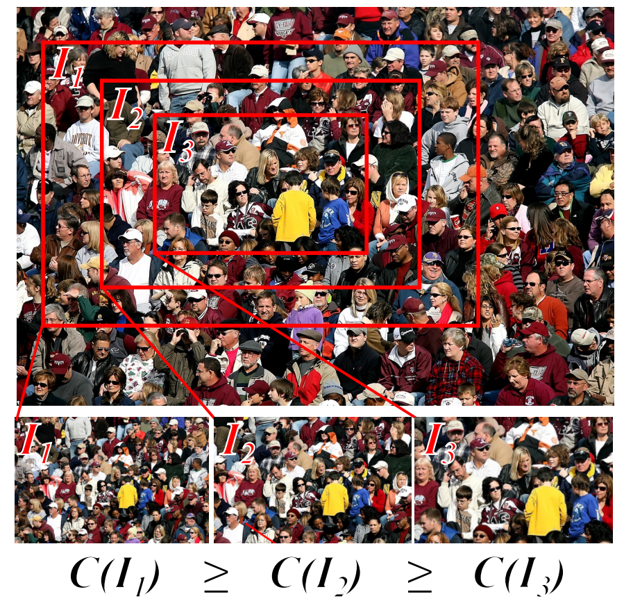

# Leveraging Unlabeled Data for Crowd Counting by Learning to Rank

The paper will appear in CVPR 2018. An [arXiv pre-print](https://arxiv.org/abs/1803.03095?context=cs) version is available.


## Authors

Xialei Liu, Joost van de Weijer and Andrew D. Bagdanov

## Institutions

[Computer Vision Center, Barcelona, Spain](http://www.cvc.uab.es/lamp/)

Media Integration and Communication Center, University of Florence, Florence, Italy

## Abstract

We propose a novel crowd counting approach that leverages
abundantly available unlabeled crowd imagery in
a learning-to-rank framework. To induce a ranking of
cropped images , we use the observation that any sub-image
of a crowded scene image is guaranteed to contain the same
number or fewer persons than the super-image. This allows
us to address the problem of limited size of existing
datasets for crowd counting. We collect two crowd scene
datasets from Google using keyword searches and queryby-example
image retrieval, respectively. We demonstrate
how to efficiently learn from these unlabeled datasets by incorporating
learning-to-rank in a multi-task network which
simultaneously ranks images and estimates crowd density
maps. Experiments on two of the most challenging crowd
counting datasets show that our approach obtains state-ofthe-art
results.

## Framework

The main idea of our approach is to address the problem of limited Crowd Counting dataset size, which allows us to leverage abundantly available unlabeled crowd imagery in a learning-to-rank framework.



## Requirments

All training and test are done in [Caffe](http://caffe.berkeleyvision.org/) framework.

1. Requirements for ```caffe ``` and  ```pycaffe ``` (see: [Caffe installation instructions](http://caffe.berkeleyvision.org/installation.html)). 
Caffe must be built with support for Python layers!

```
# In your Makefile.config, make sure to have this line uncommented
WITH_PYTHON_LAYER := 1

```

2. Download the pre-trained [VGG-16](https://gist.github.com/ksimonyan/211839e770f7b538e2d8#file-readme-md) ImageNet model for finetuning.

## Pre-trained models

The pre-trained [models](https://drive.google.com/file/d/1L0K_Co6BHh2S1tUYIs-EiYVQ_sysf4ZM/view?usp=sharing) are available to download.

## Useful tools

We use the code from [here](https://github.com/gramuah/ccnn) to download and prepare the datasets, generate the density maps and evalate the models.  

## Citation

Please cite our paper if you are inspired by the idea.

```
@inproceedings{xialei2018crowd,
title={Leveraging Unlabeled Data for Crowd Counting by Learning to Rank},
author={Liu, Xialei and van de Weijer, Joost and Bagdanov, Andrew D},
booktitle={Proceedings of IEEE Conference on Computer Vision and Pattern Recognition (CVPR)},
year={2018},
url = {https://github.com/xialeiliu/CrowdCountingCVPR18}
}
```
